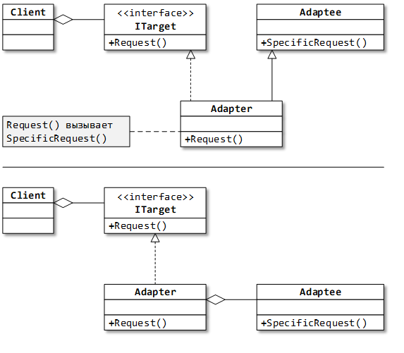

## Назначение: 
Обеспечивает коллективную работу классов, которые не были созданы для совместного использования.

Адаптер класса. Класс адаптера является наследником адаптируемого класса.*) проще переопределить поведение адаптируемого класса.
Адаптер объекта. Класс адаптера агрегирует адаптируемый объект.*) легче добавить новое поведение.

## Use case: 
Есть сторонняя библиотека кода. 
Классы из этой библиотеки не обладают необходимыми для клиента интерфейсами. 
Нужно адаптировать классы для использования клиентом.

## Примеры из .Net:
ReadOnlyCollection<T> – адаптирует произвольный список (IList<T>) к коллекции только для чтения (IReadonlyCollection<T>).
TextReader, TextWriter (BinaryReader, BinaryWriter)–адаптеры для класса Stream: чтение и запись текстовых (бинарных) данных в потоки ввода/вывода.

PS:
1. Под термином «клиент» здесь и далее подразумевается некое программное обеспечение (в частном случае – класс, компонент), 
использующее библиотеки кода, интерфейсы, классы.

2. Во многих паттернах вместо общего интерфейса допустимо использование общего абстрактного класса (и наоборот).

## Сравнение:
Adapter vs Bridge:
Похожи:
 Делегирование вызовов вложенному объекту.
 Уровень «вложенности» этого объекта.
Различаются:
 Назначение Адаптера – «подогнать» объект под интерфейс. Назначение Моста – независимое изменение абстракции и реализации.
 Адаптер обычно применяют при работе с готовыми типами, а Мост – на этапе проектирования типов.
