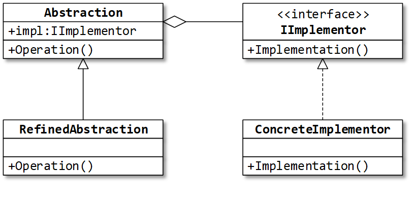

Назначение: 
позволяет разделить объект на абстракцию и реализацию и менять их независимо друг от друга.
Реализация обычно содержит основной, но примитивный (низкоуровневый) код, необходимый для функционирования системы.
Абстракция отвечает за взаимодействие с клиентом. 
Абстракция содержит экземпляр реализации и использует его для обработки запросов клиента.

Adapter vs Bridge:
Похожи:
 Делегирование вызовов вложенному объекту.
 Уровень «вложенности» этого объекта.
Различаются:
 Назначение Адаптера – «подогнать» объект под интерфейс. Назначение Моста – независимое изменение абстракции и реализации.
 Адаптер обычно применяют при работе с готовыми типами, а Мост – на этапе проектирования типов.
