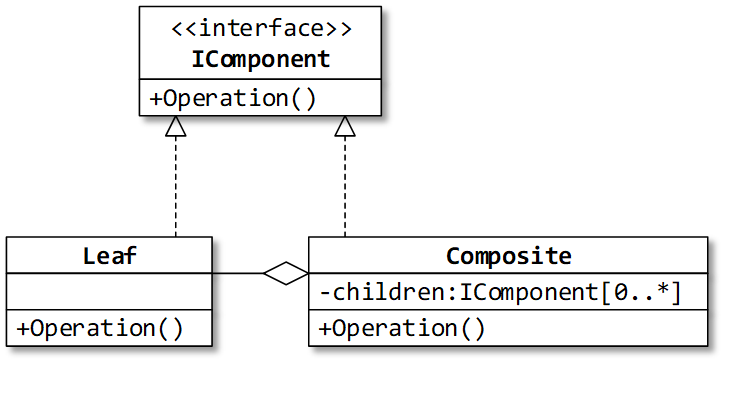

## Назначение: 
Упрощает взаимодействие клиентского кода с группой объектов, представляющих древовидную структуру.

## Use case: 
клиентский код должен одинаково обращаться как с составным объектом, так и с отдельными его частями 
(пример: кнопка-визуальный компонент-форма; XML-элемент и XML-документ).

## Примеры из .Net:
1. Деревья выражений – класс Expression и его наследники (ParameterExpression, ConstantExpression, BinaryExpression, …).
2. Классы для компонентов пользовательского интерфейса (например, FrameworkElement в WPF),
3. Объектное представление документа XML – класс XElement (XmlNode).

## Сравнение:
Composite vs Decorator:
Похожи:
 Агрегируют объект (объекты) и одновременно реализуют интерфейс объекта.
 Оба могут «соединять» объекты в структуры.
Различаются:
 Назначение Декоратора – добавить функциональность, а Компоновщика – сделать для клиента одинаковой работу с листом дерева объектов и поддеревом.