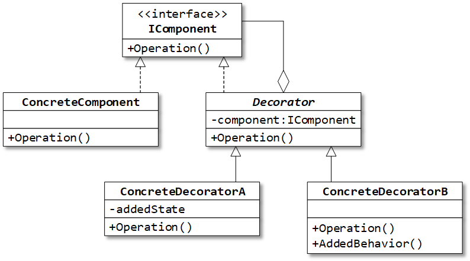

## Назначение: 
Добавляет к объекту новую функциональность – новое состояние или поведение. 
Является динамической альтернативой наследованию.

Декоратор – обёртка для декорируемого объекта и реализует тот же интерфейс, что и класс декорируемого объекта. 
Декоратор добавляет свой код до, после или вместо вызовов методов декорируемого объекта.

## Примеры из .Net:
Декораторы потоков ввода/вывода:
DeflateStream и GZipStream (сжатие данных);
CryptoStream (шифрование);
BufferedStream (буферизация).

## Пример использования:
1) Сначала поток буфферизовать, потом зашифровать, потом сжать. Или в любой другой последовательности.

## Сравнение:
Composite(Компоновщик) vs Decorator(Декоратор):
Похожи:
 Агрегируют объект (объекты) и одновременно реализуют интерфейс объекта.
 Оба могут «соединять» объекты в структуры.
Различаются:
 Назначение Декоратора – добавить функциональность, а Компоновщика – сделать для клиента одинаковой работу с листом дерева объектов и поддеревом(сделать так, чтобы клиент не работал с объектом напрямую (по разным причинам)) 
 Декоратор «размазывает» функционал (цепочки), Заместитель концентрирует его в двух точках.

Proxy(Заместитель) и Decorator(Декоратор) :
 По структуре похожи. 
 Различаются в назначении: декоратор добавляет к объекту функциональность, а заместитель контролирует доступ к объекту.

 Обычно декоратор получает объект как параметр конструктора. 
 Заместитель, как правило, сам создаёт контролируемый объект.
