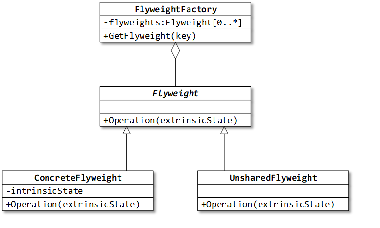

## Назначение: 
Применяется для уменьшения затрат при работе с большим количеством (почти одинаковых) объектов.

## Use case: 
Jбъекты-символы, из которых нужно составить текст в редакторе. Различаются позицией, а начертание совпадает.

Приспособленец – разделяемый объект, который можно использовать одновременно в нескольких контекстах.
У Приспособленца выделяют внутреннее и внешнее состояния:
 Внутреннее состояние хранится в приспособленце и состоит из информации, не зависящей от контекста.
 Внешнее состояние зависит от контекста. Клиент отвечает за передачу внешнего состояния приспособленцу, когда в этом возникает необходимость.
