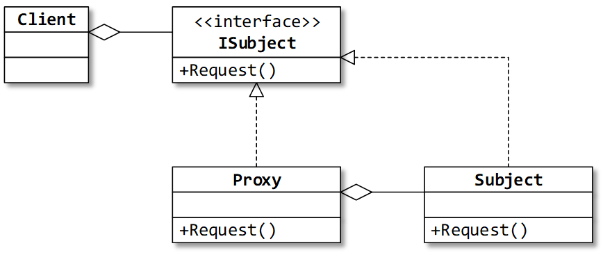

## Назначение: 
Контролирует доступ к заданному объекту, перехватывая все вызовы к этому объекту. 
Для клиента выглядит как замещаемый объект.

## Use case: 
Клиент работает с локальным объектом-заместителем, направляющим вызовы методов к объекту на удалённой машине. 
И локальный, и удалённый объект реализую один и тот же интерфейс.

Виды:
1) Удалённый заместитель (remote proxy) обеспечивает связь с замещаемым объектом, который находится в другом адресном пространстве.
2) Виртуальный заместитель (virtual proxy) реализует создание замещаемого объекта только тогда, когда он действительно необходим.
3) Защищающий заместитель (protection proxy) проверяет, имеет ли вызывающий объект необходимые для выполнения запроса права.

Примеры:
1. Заместители в коммуникационных технологиях WCF и .NET Remoting (ChannelBase<T> в WCF) (это примеры удалённых заместителей).

2. Заместители в ORM-библиотеках (NHibernate) для отслеживания изменений сущности или «ленивой загрузки» зависимых сущностей.

## Сравнение:

Заместитель и Декоратор (Схожести и отличия):
По структуре похожи. 
Различаются в назначении: декоратор добавляет к объекту функциональность, а заместитель контролирует доступ к объекту.

Обычно декоратор получает объект как параметр конструктора. 
Заместитель, как правило, сам создаёт контролируемый объект.
